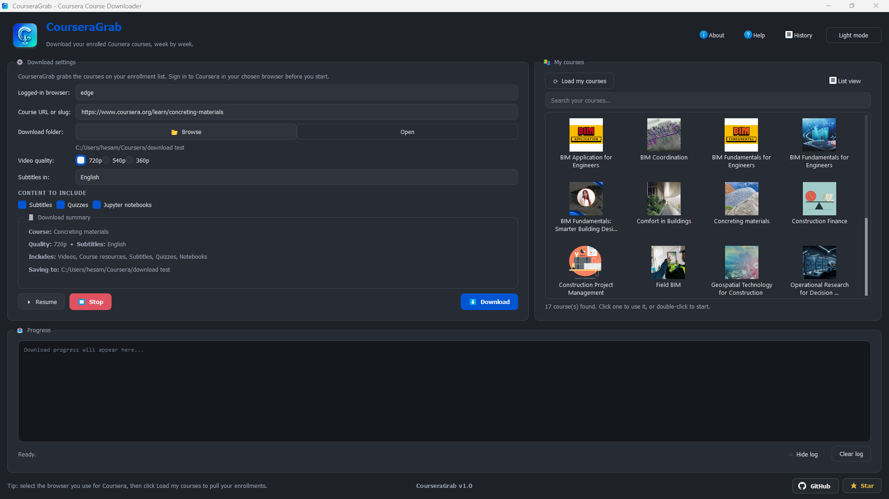

<div align="center">


# CourseraGrab

**Download your enrolled Coursera courses, week by week.**

Videos, subtitles, quizzes, notebooks and resources, organised just like on the site.


[](https://github.com/Hesamsamani/CourseraGrab)

---

<div align="center">

  
</div>
</div>

---

## ✨ Features

- **One-Click Offline Downloading:** Browse your enrolled Coursera courses and start downloading entire weeks with a single click.
- **Complete Course Materials:** Automatically grabs high-quality videos, localized subtitles, quizzes, Jupyter notebooks, and reading resources.
- **Live GUI Progress Tracking:** Clean PyQt5 interface featuring a live progress bar, real-time stop button, and download history.
- **Customizable UI:** Switch between list and grid views, and toggle between dark and light themes.
- **Smart Resuming:** Pause and resume downloads without losing progress, with quick access to your downloaded folders.
- **Quality Control:** Pick your preferred video resolution and select specific subtitle languages before downloading.

## 🚀 Getting Started

There are two ways to use CourseraGrab: downloading the standalone app (recommended) or running it via the Python terminal.

### Method 1: Download the Windows App (.exe)
You do not need Python installed for this method. 

[](https://github.com/Hesamsamani/CourseraGrab/releases/latest)

1. Click the button above to go to the Releases page.
2. Download the `CourseraGrab.exe` file from the **Assets** section.
3. Double-click the `.exe` file to run the app. 

### Method 2: Run via Terminal (Python)
If you prefer to run the raw Python code, make sure you have Python 3.12+ installed.

> ⚠️ **CRITICAL:** You MUST open your terminal (Command Prompt, PowerShell, or your IDE's Terminal) as an **Administrator**. If you do not run the terminal as an administrator, the script will not have permission to read your browser's login cookies and will fail to load your courses.

```bash
pip install -r requirements.txt
python maingui.py
```

---
## Credits


Built by **Hesam Samani** &middot; [LinkedIn](https://www.linkedin.com/in/hesam-samani/) &middot; [GitHub](https://github.com/Hesamsamani)

<sub>For personal, offline study of courses you are enrolled in. Please respect Coursera's Terms of Service.</sub>
