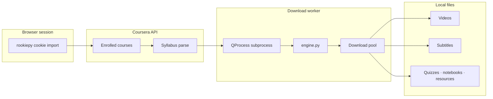
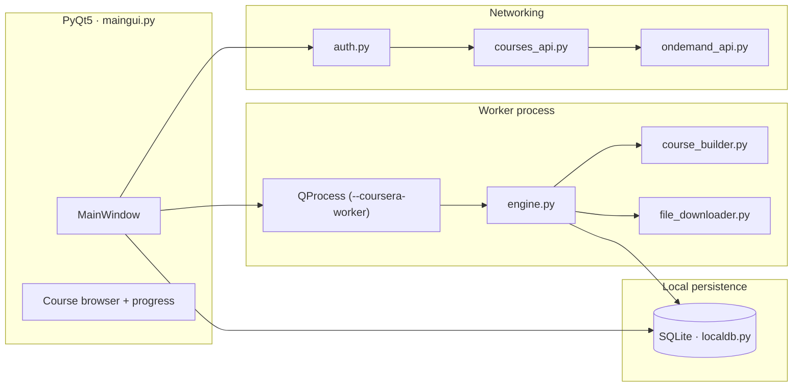

<div align="center">


# CourseraGrab

**Windows GUI to download enrolled Coursera courses — videos, subtitles, and resources offline.**

Videos, subtitles, quizzes, notebooks and resources, organised week by week just like on the site.

A privacy-first Windows desktop app — no telemetry, no cloud uploads.

<p>
  <a href="https://github.com/Hesamsamani/CourseraGrab/releases/latest"></a>
  
  
  
  
</p>

<p>
  
  
  
</p>


</div>

## ⚙️ How it works



1. **Import session** — CourseraGrab reads your browser login cookies via `rookiepy` (no password storage).
2. **List courses** — the GUI fetches enrolled courses and builds a week-by-week syllabus tree.
3. **Download in worker** — a `QProcess` subprocess runs `engine.py` so you can stop/resume without freezing the UI.
4. **Save locally** — videos, subtitles, quizzes, notebooks, and reading resources land in your chosen folder.

---

## ✨ Features

- **One-Click Offline Downloading:** Browse your enrolled Coursera courses and start downloading entire weeks with a single click.
- **Complete Course Materials:** Automatically grabs high-quality videos, localized subtitles, quizzes, Jupyter notebooks, and reading resources.
- **Live GUI Progress Tracking:** Clean PyQt5 interface featuring a live progress bar, real-time stop button, and download history.
- **Customizable UI:** Switch between list and grid views, and toggle between dark and light themes.
- **Smart Resuming:** Pause and resume downloads without losing progress, with quick access to your downloaded folders.
- **Quality Control:** Pick your preferred video resolution and select specific subtitle languages before downloading.

## 🛠️ Tech Highlights

| Area | Implementation |
|------|------------------|
| **UI** | PyQt5 desktop app with dark/light themes, list/grid course browser |
| **Auth** | Browser cookie extraction via `rookiepy` (no password storage) |
| **Downloads** | Multithreaded pool + isolated worker subprocess for clean stop/resume |
| **Persistence** | Local SQLite history, settings, and download state |
| **Packaging** | PyInstaller single-file `.exe` for Windows distribution |

**Stack:** Python 3.12 · PyQt5 · requests · BeautifulSoup · rookiepy · PyInstaller

The download engine is adapted from the open-source [coursera-dl](https://github.com/coursera-dl/coursera-dl) project.

---

## 🏗 Architecture



| Layer | Tech |
|-------|------|
| GUI | PyQt5 — course browser, themes, live progress bar |
| Worker | Isolated `QProcess` subprocess for clean stop/resume |
| Engine | `engine.py` + coursera-dl–adapted download pipeline |
| Auth | Browser cookies via `rookiepy` — no credential storage |
| Persistence | SQLite history, settings, and download state |

---

## 🚀 Getting Started

There are two ways to use CourseraGrab: downloading the standalone app (recommended) or running it via the Python terminal.

### Method 1: Download the Windows App (.exe)
You do not need Python installed for this method.

[](https://github.com/Hesamsamani/CourseraGrab/releases/latest)

1. Click the button above to go to the Releases page.
2. Download the `CourseraGrab.exe` file from the **Assets** section.
3. Double-click the `.exe` file to run the app.

### Method 2: Run via Terminal (Python)
If you prefer to run the raw Python code, make sure you have Python 3.12+ installed.

> ⚠️ **CRITICAL:** You MUST open your terminal (Command Prompt, PowerShell, or your IDE's Terminal) as an **Administrator**. If you do not run the terminal as an administrator, the script will not have permission to read your browser's login cookies and will fail to load your courses.

```bash
pip install -r requirements.txt
python maingui.py
```

---

## Credits

Built by **Hesam Samani** · [LinkedIn](https://www.linkedin.com/in/hesam-samani/) · [GitHub](https://github.com/Hesamsamani) · [Portfolio](https://hesamsamani.codes)

<sub>For personal, offline study of courses you are enrolled in. Please respect Coursera's Terms of Service.</sub>